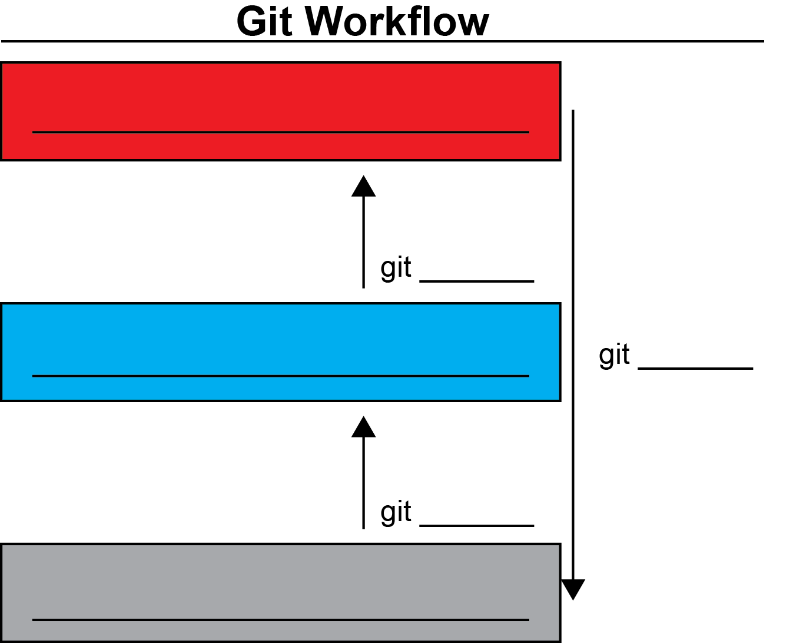

# Tutorial: Version control with Git

[Git](https://git-scm.com/) is a popular, free, distributed [version control system](https://www.atlassian.com/git/tutorials/what-is-version-control). 

In this tutorial, we will learn the day-to-day basics of working with Git and collaborating with others using the Git-based internet hosting service provided by [GitHub](https://github.com/). 

Completing this tutorial will help you in your research activities, e.g., to develop software more efficiently.

See also the Jupyter version of the [Git/GitHub tutorial](git_tutorial.ipynb).

**Expected learning outcome**:

- [x] Set up Git on your computer for software development
- [x] Sign up for a free [GitHub](https://github.com/) account (necessary for the Computational Physics lecture). You can even get GitHub Pro for free [through Ohio University](https://help.ohio.edu/TDClient/30/Portal/KB/ArticleDet?ID=499). Just follow the link and the instructions.  
- [x] Familiarize yourself with the rich literature on Git available online
- [x] Understand the Git workflow and implement it using the basic set of Git commands
- [x] Get directions for more advanced applications of Git in your research activities 

> **Note**
> Make sure you have signed up on GitHub (free account!), as you will need it to participate in the lectures and hand in your homework assignments. Use your Ohio U email address.


## Initial setup

Let's check whether Git is already installed on your computer. This should be the case for most Linux distributions.
```shell
git --version
```
If you get an error, follow [these steps](https://www.atlassian.com/git/tutorials/install-git) for your operating system to install Git on your computer. More details can also be found [here](https://github.com/git-guides/install-git).


Next, let's tell Git about your name and email address.
```shell
git config --global user.name "First-name Surname"
git config --global user.email "you@email.com"
```

> **Note**
> Setting your real name and email address is important to credit you for your collaborative research work. They will appear in log files. Please use your Ohio U email address for the lectures.

One more step: different systems handle line endings and line breaks differently. 

```shell
//for Mac or Linux users
git config --global core.autocrlf input

//for Windows users
git config --global core.autocrlf true
```

If you open a file created on another system and do not have this config option set, Git will think you made changes to the file based on how your system handles this type of file.

`autocrlf` stands for auto carriage return line feed.
  
Follow [these steps](https://github.com/join) to sign up on GitHub for a free account.

> **Note**
> Signing up for a GitHub account is free of charge. Use your Bobcat email address to enable educational features.

### SSH key authentication

Next, we need to set up SSH keys to give you easy access to your GitHub account (without entering your login credentials all the time).

* Open `Terminal` in your virtual machine.
* Paste the text below, substituting in your GitHub email address:
```shell
ssh-keygen -t ed25519 -C "your_email@example.com"  # use here the email address you use for GitHub!
```
* We will not use a passphrase, so just hit `enter` without any other keyboard input.
* Start the ssh-agent in the background.
```shell
eval "$(ssh-agent -s)"
# e.g., Agent pid 59566
```
* Add your SSH private key to the ssh-agent.
```shell
ssh-add ~/.ssh/id_ed25519
```
* Copy the SSH public key to your clipboard like so:
```shell
cat ~/.ssh/id_ed25519.pub
# Then select and copy the contents of the id_ed25519.pub file
# displayed in the terminal to your clipboard
```
* Add the SSH public key to your account on GitHub. 
* In the upper-right corner of any GitHub page, click your profile photo, then click `Settings`.
* In the `Access` section of the sidebar, click `SSH and GPG keys`.
* In the `Title` field, add a descriptive label for the new key. We recommend `VirtualBox: Computer Lab`.
* Select the type of key to be `authentication`
* In the `Key` field, paste your public key and click `Add SSH key`. (For security reasons, you will receive an email notification that an SSH key was added to your account.)
* If prompted, confirm access to your account on GitHub.

If that did not work and/or for more information, see the following GitHub tutorials:
1. [Generating a new SSH key and adding it to the ssh-agent](https://docs.github.com/en/authentication/connecting-to-github-with-ssh/generating-a-new-ssh-key-and-adding-it-to-the-ssh-agent?platform=linux)
2. [Adding a new SSH key to your GitHub account](https://docs.github.com/en/authentication/connecting-to-github-with-ssh/adding-a-new-ssh-key-to-your-github-account)


## Let's get started

There are many excellent resources online available. Here is just a selection:

Reading:
* [GitHub tutorials](https://github.com/git-guides)
* [Tutorialspoint tutorials](https://www.tutorialspoint.com/git/index.htm)
* [Atlassian tutorials](https://www.atlassian.com/git/tutorials/setting-up-a-repository)
* [W3 Schools tutorials](https://www.w3schools.com/git/default.asp?remote=github)
* [Official Git documentation](https://git-scm.com/doc)
* (and many more)

**When in doubt, use the first two resources.** Note that we use GitHub rather than BitBucket, which is also a Git-based internet hosting service.

Video tutorials:
* [Git Tutorial for Beginners: Learn Git in 1 Hour](https://www.youtube.com/watch?v=8JJ101D3knE)
* [What is Git | What is GitHub | Git Tutorial | GitHub Tutorial | Devops Tutorial | Edureka](https://www.youtube.com/watch?v=xuB1Id2Wxak)
* [Simplilearn Git tutorial](https://www.simplilearn.com/tutorials/git-tutorial)
* (and many more)

Cheat Sheets:
* [Atlassian Git Cheat Sheet](https://www.atlassian.com/git/tutorials/atlassian-git-cheatsheet)
* [GitHub Cheat Sheet](https://training.github.com/downloads/github-git-cheat-sheet/)
  
> **Warning**
> Don't experiment with Git in directories that contain not-backed-up files, such as homework, etc.

## Why using Version Control System (VCS)?

1. **Track changes in source code**
   * Enable the ability to revert to a previous version if an issue arises.
   * Support concurrent work on multiple "branches" of the software.
   * Tag revisions to maintain records of which software version was used for specific purposes (e.g., "release-1.0", "paper-A-final", etc.).
2. **Facilitate collaborative work**
   * Allow multiple authors to make changes to the same code base simultaneously.
   * Clearly communicate and visualize changes in the code base to all team members involved.

## `Git` Workflow

In `Git`, the source code or digital content is stored in a **repository**.

- The repository not only contains the latest version of all files but also the complete history of all changes made to the files since their addition to the repository.
- A user can **checkout** the repository to obtain a local working copy of the files. Changes are made to the files within the local working directory, where files can be added, removed, or updated.
- Once a task is complete, the changes made to the local files are **committed** (saved) to the repository.
- If someone else has made changes to the same files, a **conflict** may occur. In many cases, conflicts can be **resolved** automatically by the system; however, sometimes it may be necessary to **merge** the different changes manually.
- It is often useful to create a new **branch** in a repository, or to **fork** or **clone** an entire repository, when undertaking larger experimental developments. The main branch in a repository is typically referred to as the **master** or **trunk**. Once work on a branch or fork is completed, it can be merged back into the master branch or repository.
- With distributed RCSs such as Git or Mercurial, we can **pull** and **push** changesets between different repositories. For example, changes can be transferred between a local copy of the repository and a central online repository, such as one hosted on GitHub.

## Self-Learning

Study at least one of these resources alone or in small groups. Make sure you obtain a basic understanding of the standard Git commands, including the following ones:
* `git help`
* `git status`
* `git init`
* `git commit`
* `git diff`
* `git log`
* `git branch`
* `git clone`
* `git push`
* `git pull`
* `git revert` (optional)
* `git reset` (optional)
* `git amend` (optional)

  
Answer the following questions in the process.

### General questions
1. Who created Git originally? What else are they known for?
2. What does _distributed_ version control mean, and what are the advantages?
3. Is Git and GitHub the same? Explain.
4. Does Git back up my data? Explain.
5. What is a branch? Explain the concept of branching. Why is it so useful?
6. Does Git automatically add new files to the repository and start tracking them?
7. Many Git commands provide an interactive mode. When and why is this mode helpful?
8. What is a SHA and what (important) role does is play for Git?
9. Fill in the six gaps in the figure illustrating the usual Git workflow. 


### Git commands

What is the command to...
1. ... get the installed version of Git?
2. ... set the user email for the current repository?
3. ... add all files and changes of the current folder to the staging environment of the Git repository?
4. ... get the current status of the Git repository?
5. ... initialize Git on the current repository?
6. ... to view the history of commits for the repository?

### Branching

What is the command to...
1.  ... create a new branch with name "feature"?
2. ... move to the branch named "master"? When moving to a branch, what is the option to create the branch if it does not exist?
3. ... merge the current branch with the branch "feature"?
4. ... delete the branch "feature"?
5. ... show the differences between the current branch and the branch "feature"?

### Remotes

1. What is the command to push the current repository to the remote origin?
2. `git pull` is the combination of which commands? What do they do?


## Mini Project

### Step 1

1. Create a remote repository on GitHub. Hint: follow [these instructions](https://www.w3schools.com/git/git_remote_getstarted.asp?remote=github).
   * When and why is a license important? Add the MIT license while creating your repository.
   * What is the `.gitignore` file for? Which template could be useful?
   * Why is a README file important?
2. Clone your repository to a folder named `git-test` on your local computer. Navigate to the folder. If you get an SSH error, set up key authentication as described [here](https://docs.github.com/en/authentication/connecting-to-github-with-ssh).
3. Check the status of your repository. What do you expect the status to be? Give the short version of the status report a try.
4. Inspect the change history of your repository, both on GitHub and on your local computer.

### Step 2

1. In `.gitignore` on your local computer, add a single (if possible) line to ignore all
    *  `.temp` files:
    *  files in any directory named `temp`
    *  files named `temp1.log`, `temp2.log`, and `temp3.log`
    * `.log` files, except for `main.log`
6. Add some text to the `README.md`. You could use [dummy text](https://www.lipsum.com/).
7. Check the status of your repository again. What do you expect the output will be? What has changed since the last time you checked the status? 
8. Display and inspect the changes you made in the working directory. (Hint: `git diff`)
9. Stage all (modified) files.
10. Check the status of your repository again. Does the output match your expectation?
11. Commit these changes with the message "First release!"
12. Inspect the history of the commits in your repository.
13. Push the current branch to its default remote origin on GitHub.
14. Inspect your changes on GitHub.

### Step 3

1. Create a new branch `feature` on GitHub. Make a few changes or add a file with some content. Leave some typos (which we will correct later on).
2. Synchronize your local repository with GitHub.
3. Check the status of your repository.
4. Move to the `feature` branch you created on GitHub and inspect the changes.
5. Create a new branch called `bugfix`, correct the typos previously made (feel free to add some more random content), and commit your "bugfixes" in.
6. List the existing branches. Does the output match your expectation?
7. Merge the changes in the branch `bugfix` into `main` branch. What does "fast-forward merge" mean in this context?
8. Delete all but the `main` branch.
9. Check the status of your repository.
10. Synchronize your local repository with GitHub.

> **Note**
> Did you know that [Overleaf](https://www.overleaf.com/) provides [Git integration](https://www.overleaf.com/learn/how-to/Git_integration)? This allows for easy backups and synchronization of work made offline.

### Step 4 (optional)

1. Let's create two files, `file1.md` and `file2.md`, with some content.
2. Commit `file1.md` but not the other. 
3. You realize you have "forgotten" to add `file2.md` to the previous commit. Amend the previous commit to include `file2.md`, commit message "adds file1.md and file2.md"
4. Show the log of the repository, showing just one line per commit.
5. Create and move to the new branch `addon`.
6. Create and commit another file, `file3.md`, with some content.
7. Revert the latest two commits, which added the three files. Imagine you realized that adding those files was a mistake. What is the option to skip the commit message editor?
8. Switch back to the original branch (probably `main`) and reset to the commit with the hash corresponding to the commit before you added `file1.md` and `file2.md`. 
9. Compare this branch with `addon`. What do you expect?


## Outlook: advanced Git

In this tutorial, you have learned the most important Git commands and how to embed them in the Git workflow. But Git's power and flexibility go well beyond. Feel free to explore more advanced commands, including the following ones:
* `git add -p`
* `git show`
* `git merge`
* `git rebase`
* `git reflog`

> **Warning**
> `git rebase` allows you to rewrite the entire history of your project and thus can lead to unexpected data loss. It's a powerful and useful tool, but be careful and always back up your data.

The below selection of resources for further reading and training ("katas") might be useful for your research endeavors with Git:
* https://coderefinery.github.io/git-intro/basics/#what-is-git-and-what-is-a-git-repository
* https://learngitbranching.js.org/?locale=en_US
* https://github.com/eficode-academy/git-katas/tree/master
* https://githubtraining.github.io/training-manual/#/01_getting_ready_for_class
* https://www.w3schools.com/git/default.asp?remote=github
* https://git-scm.com/docs/gittutorial


## Feedback

Please let us know if you have any suggestions or comments on this tutorial. Our tutorials are a work in progress.
